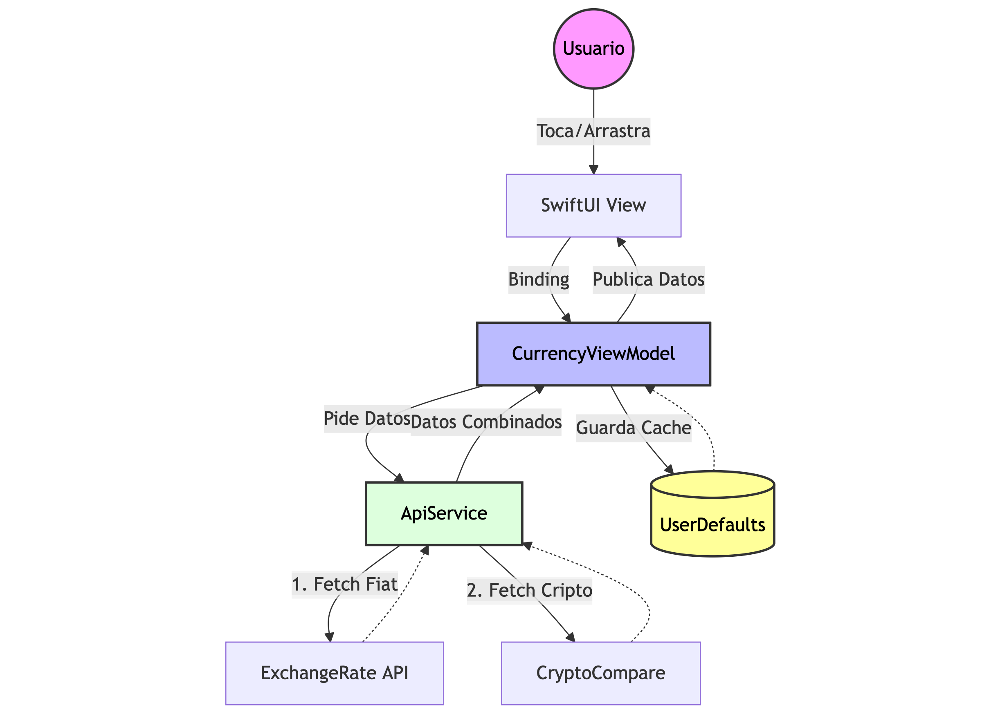

# TickerTape 📉


**TickerTape** is a high-performance, retro-styled currency converter for iOS. Inspired by the aesthetics of 80s LED tickers and the *Matrix*, it provides real-time conversion between 160+ fiat currencies and major cryptocurrencies.

Built with **SwiftUI** and **Swift Concurrency**, TickerTape features a robust offline mode, a gamified ad-removal system, and seamless integration with StoreKit 2.

---

## 📱 Screenshots

| Main Converter | Add Currency | Settings & Pro |
|:---:|:---:|:---:|
|  |  |  |
| *Real-time conversion with LED aesthetic* | *Search 160+ currencies & Crypto* | *Gamified Ad-Removal & IAP* |

---

## ✨ Key Features

* **Hybrid Data Engine:** Seamlessly merges data from `ExchangeRate-API` (Fiat) and `CryptoCompare` (Crypto) into a single unified list.
* **Retro UI/UX:** Custom "Matrix" background implementation, `VT323` retro typography, and haptic feedback for a tactile feel.
* **Smart Persistence:** Uses `UserDefaults` to cache rates, allowing full functionality in **Offline Mode**.
* **Interactive List:** Drag-and-drop reordering and swipe-to-delete gestures.
* **Custom Input System:** A bespoke numeric keypad tailored for currency input, handling decimal logic dynamically based on the currency type (e.g., JPY vs USD).
* **Gamified Monetization:**
    * **StoreKit 2:** Lifetime Pro unlock.
    * **Rewarded Ads:** Users can "bypass the firewall" by watching ads to earn ad-free time (1 ad = 2 hours; 5 ads streak = 24 hours).
* **Localization:** Fully localized in English, Spanish, German, French, Italian, and Portuguese.

---

## 🛠 Tech Stack

### UI & Architecture
* **SwiftUI:** 100% declarative UI. Complex layouts using `ZStack`, `GeometryReader` (for the scrolling ticker effect), and custom transitions.
* **MVVM (Model-View-ViewModel):** Strict separation of logic. Views observe `CurrencyViewModel` via the `Combine` framework.
* **Combine:** Used for reactive state management (`@Published` properties, `ObservableObject`).

### Networking & Data
* **Swift Concurrency:** Heavy use of `async/await` for parallel data fetching (`TaskGroup` or `async let`).
* **URLSession:** Native networking layer without third-party wrappers.
* **Codable:** Type-safe JSON parsing for API responses.

### Monetization & Tools
* **Google Mobile Ads SDK:** Integration of Banner and Interstitial/Rewarded ads.
* **StoreKit 2:** Modern Swift implementation for In-App Purchases and entitlement verification.
* **UIKit Integration:** `UIViewRepresentable` used to bridge Google AdMob views into SwiftUI.

---

## 🏗 Architecture

TickerTape follows a clean **MVVM** pattern to ensure testability and separation of concerns.



* **Views:** (e.g., ContentView, CurrencyRowView) Handle layout and user input only.
* **ViewModels:** (e.g., CurrencyViewModel, StoreManager) Handle business logic, calculations, and state management.
* **Services:** (ApiService) Abstract the networking logic, handling errors and data merging.

---

## 📂 Project Structure

```
TickerTape/
├── App/
│   ├── TickerTapeApp.swift      # Entry point, Global Appearance config
│   └── Info.plist               # Config & AdMob IDs
├── UI/
│   ├── Screens/
│   │   ├── ContentView.swift    # Main Tab View wrapper
│   │   ├── AddCurrencyView.swift# Search & Selection screen
│   │   └── SettingsView.swift   # Configuration & IAP
│   ├── Components/
│   │   ├── CurrencyRowView.swift# Individual list item (Drag & Drop)
│   │   ├── InputSheetView.swift # Custom Numeric Keypad
│   │   ├── AdBannerView.swift   # AdMob Bridge
│   │   └── MatrixBackground.swift # Custom drawing background
│   └── Visuals/
│       └── Color+Extension.swift
├── ViewModel/
│   ├── CurrencyViewModel.swift  # Core logic engine
│   ├── SettingsManager.swift    # App preferences
│   └── ThemeManager.swift       # Dark/Light mode logic
├── Model/
│   ├── CurrencyModel.swift      # Data structures
│   └── CurrencyHelpers.swift    # Formatters & Static Data
├── Service/
│   ├── ApiService.swift         # Networking (Fiat + Crypto)
│   ├── StoreManager.swift       # StoreKit 2 Logic
│   └── InterstitialManager.swift# AdMob Logic
└── Resources/
    ├── Assets.xcassets          # Flags & Icons
    ├── Fonts/                   # VT323-Regular.ttf
    └── Localization/            # .strings files (en, es, de, etc.)
```

---

## 📄 License

This project is licensed under the MIT License
