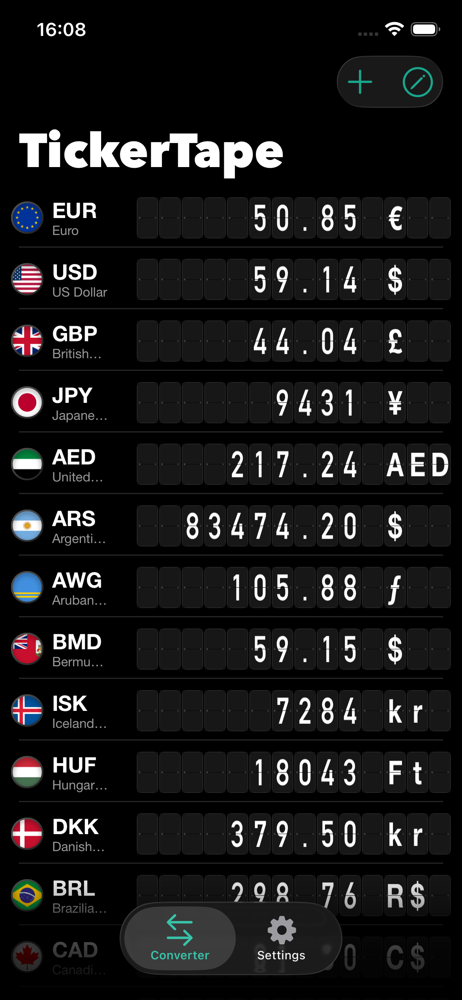
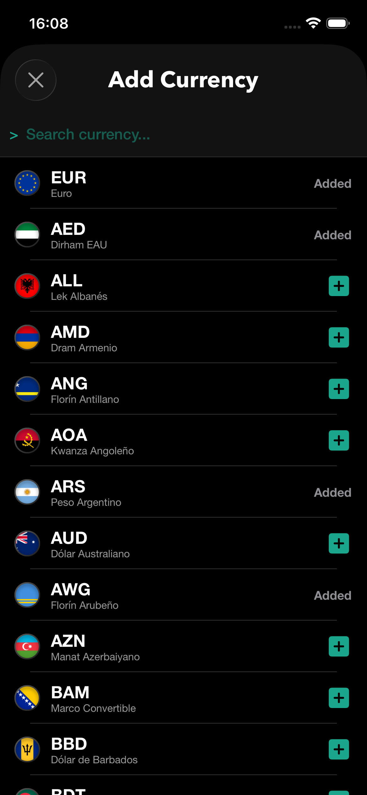
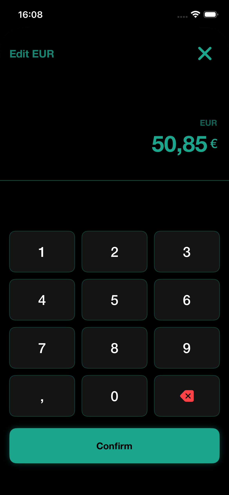
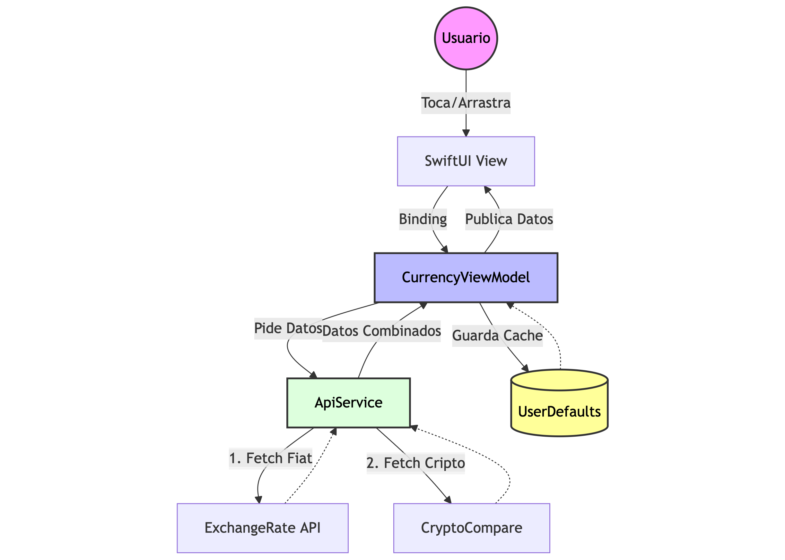

# TickerTape 2.0

**TickerTape** is a premium, minimalist iOS currency converter. Its interface design is inspired by the nostalgic, industrial aesthetics of **mechanical split-flap (Solari) boards** traditionally found in classic European train stations and airports, transforming a daily utility into a unique visual and tactile experience.

Version **2.0.0** introduces a total redesign of the graphic interface and user interaction model, adopting an elegant look in warm dark tones with comprehensive native support for both Light and Dark Modes.

---

## Screenshots

| Main Converter | Add Currency | Calculator |
|:---:|:---:|:---:|
|  |  |  |

---

## Main Features

### 1. Interactive Solari Split-Flap Board
* **Realistic Physics and Sounds**: The card segments flip with simulated 3D physics and trigger sequential mechanical clicking sounds as values change, faithfully recreating the feel of vintage flap boards.
* **Industrial Grotesque Typography**: Built using the **`DINAlternate-Bold`** typeface stretched vertically (`.scaleEffect(y: 1.15)`) for extreme legibility and a retro-industrial aesthetic.

### 2. Symmetrical Card Layout
* The digit card slots of all currency rows maintain a fixed, symmetrical width of exactly 10 slots.
* The currency symbol cards are displayed statically on the right side, left-aligned inside exactly 3 card slots.

### 3. Interactive Long Number Viewer (Hotfix v2.0.1)
* If a conversion value exceeds 10 digits, the 10th card displays a retro truncation indicator (`>`).
* A mint green info icon **`(i)`** will automatically appear next to the currency code.
* Tapping this icon triggers a haptic impact and presents a native alert containing the **complete un-truncated number with all decimals**, along with a direct action to copy it to the clipboard.

### 4. Dynamic Theme Engine (Light & Dark Modes)
* The application automatically adapts to your system theme, or allows manually selecting Light or Dark mode.
* In **Light Mode**, the Solari card flaps adopt a subtle off-white shade with dark charcoal text, creating a beautiful contrast on clean backgrounds.

### 5. Native iOS Gestures & Smooth Transition
* Migrated the listing mechanism to a native SwiftUI `List` container.
* Native support for dragging rows to reorder lists and swiping to delete items (*swipe-to-delete*).
* Card modules automatically hide with a scale and opacity animation when entering edit mode, ensuring rows never expand vertically or squeeze.

### 6. Smart Ad Placements & StoreKit Store
* **Interleaved Ad Banner**: The advertisement banner automatically anchors at position 6 (index 5) for lists with 5 or more items, and is completely hidden during edit mode to prevent any reordering layout interruptions.
* **Dynamic Pricing**: Fully integrated with **StoreKit 2** to query Apple App Store servers and show dynamic, localized premium pricing in the user's account currency.

---

## Tech Stack

* **Language**: Swift 5.9+
* **Framework**: SwiftUI (SwiftUI native App life cycle)
* **Architecture**: Clean MVVM (Model-View-ViewModel)
* **Localization**: Native support for 6 languages (Spanish, English, French, German, Italian, and Portuguese).
* **Framework Dependencies**:
  * `StoreKit 2` (In-App Purchases)
  * `GoogleMobileAds` (AdMob - Banner & Interstitial ads)
  * `UIKit / AudioToolbox` (Haptic feedback engine & split-flap sound playback)

---

## Architecture

TickerTape follows a clean **MVVM** pattern to ensure testability and separation of concerns.

* **Views:** (e.g., ContentView, CurrencyRowView) Handle layout and user input only.
* **ViewModels:** (e.g., CurrencyViewModel, StoreManager) Handle business logic, calculations, and state management.
* **Services:** (ApiService) Abstract the networking logic, handling errors and data merging.

---

## License

This project is licensed under the MIT License
